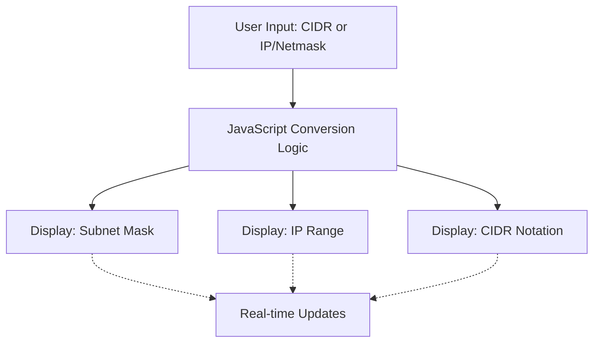

# IP Calculator

A responsive web-based tool that performs real-time conversions between CIDR notation, IP addresses, and subnet masks. The calculator updates results as you type, providing instant feedback without requiring form submission.


## 🚀 Features

### Core Functionality
- **CIDR to Subnet Mask**: Convert CIDR notation (e.g., `/24`, `/64`) to subnet mask format
- **CIDR to IP Range**: Calculate IP address ranges from CIDR notation
- **IP/Mask to CIDR**: Convert IP address and subnet mask combinations to CIDR notation
- **Real-time Updates**: Results update instantly as you type
- **Dual Protocol Support**: Works with both IPv4 and IPv6 addresses

### User Experience
- **Responsive Design**: Optimized for mobile, tablet, and desktop devices
- **Input Validation**: Real-time validation with helpful error messages
- **Visual Feedback**: Clear error states and success indicators
- **Accessibility**: Supports reduced motion and high contrast preferences
- **Clean Interface**: Intuitive layout with clear section divisions

## 📋 Supported Conversions

| Input Type | Output | Example |
|------------|--------|---------|
| CIDR (`/24`) | IPv4 Subnet Mask | `255.255.255.0` |
| CIDR (`/24`) | IPv4 IP Range | `192.168.1.0 - 192.168.1.255` |
| CIDR (`/64`) | IPv6 Subnet Mask | `ffff:ffff:ffff:ffff::` |
| IP + Mask (`192.168.1.1` + `255.255.255.0`) | CIDR | `/24` |

## 🛠️ Technical Details

### Architecture


### Technology Stack
- **Frontend**: Pure HTML5, CSS3, and vanilla JavaScript
- **No Dependencies**: Zero external libraries or frameworks
- **Modern Browser Support**: Uses modern JavaScript features with fallbacks

### IPv4 Functions
- `cidrToSubnetMask()`: Converts CIDR to dotted decimal subnet mask
- `cidrToIpRange()`: Calculates network and broadcast addresses from CIDR
- `ipAndMaskToCidr()`: Derives CIDR notation from IP and subnet mask

### IPv6 Functions
- `cidrToIpv6SubnetMask()`: Converts CIDR to IPv6 subnet mask format
- `cidrToIpv6Range()`: IPv6 range calculation (simplified implementation)

### Input Validation
- **CIDR Validation**: Ensures values are between 0-128
- **IPv4 Validation**: Proper dotted decimal format checking
- **IPv6 Validation**: Hexadecimal colon notation validation
- **Subnet Mask Validation**: Ensures contiguous bit pattern

## 🚀 Getting Started

### Prerequisites
- Modern web browser (Chrome, Firefox, Safari, Edge)
- Local web server (optional, for development)

### Installation

1. **Clone or download** the project files:
   ```bash
   git clone <repository-url>
   cd ipcalculator-windsurf
   ```

2. **Start a local server** (recommended):
   ```bash
   # Using Python 3
   python3 -m http.server 8000

   # Using Python 2
   python -m SimpleHTTPServer 8000

   # Using Node.js (if you have it installed)
   npx serve .
   ```

3. **Open in browser**:
   Navigate to `http://localhost:8000` or open `index.html` directly

### File Structure
```
ipcalculator-windsurf/
├── index.html          # Main HTML structure
├── script.js           # JavaScript conversion logic
├── styles.css          # Responsive CSS styling
├── docs/
│   └── plan.md        # Project documentation
└── README.md          # This file
```

## 💻 Usage

### Basic Usage

1. **CIDR to Conversions**:
   - Enter a CIDR value (e.g., `/24`) in the first input field
   - View subnet mask and IP range results instantly

2. **IP/Mask to CIDR**:
   - Enter IP address in the first field (e.g., `192.168.1.1`)
   - Enter subnet mask in the second field (e.g., `255.255.255.0`)
   - View CIDR notation result immediately

### Examples

#### IPv4 Examples
- **CIDR `/24`**: Subnet Mask `255.255.255.0`, Range `192.168.1.0 - 192.168.1.255`
- **CIDR `/16`**: Subnet Mask `255.255.0.0`, Range `192.168.0.0 - 192.168.255.255`
- **IP `10.0.0.1` + Mask `255.255.255.252`**: CIDR `/30`

#### IPv6 Examples
- **CIDR `/64`**: Subnet Mask `ffff:ffff:ffff:ffff::`
- **CIDR `/48`**: Subnet Mask `ffff:ffff:ffff::`

## 🎨 Customization

### Styling
The calculator uses CSS custom properties and modern layout techniques. Key customization areas:

- **Colors**: Modify the gradient in `header` selector
- **Typography**: Update font stack in `body` selector
- **Spacing**: Adjust padding and margin values throughout
- **Responsive Breakpoints**: Modify media queries for different screen sizes

### Functionality
JavaScript functions are modular and can be extended:

- Add new conversion types in `convertInput()` function
- Extend validation in `convertInputWithValidation()` function
- Add new calculation methods for additional IP utilities

## 🔧 Development

### Code Organization
- **HTML**: Semantic structure with proper ARIA labels
- **CSS**: Mobile-first responsive design with accessibility features
- **JavaScript**: Functional programming approach with clear separation of concerns

### Adding Features
1. Define new conversion function
2. Add validation logic
3. Update HTML interface
4. Style new elements
5. Test across devices

### Browser Compatibility
- Modern browsers (Chrome 60+, Firefox 55+, Safari 12+, Edge 79+)
- Progressive enhancement for older browsers
- Graceful degradation for missing features

## 📝 API Reference

### JavaScript Functions

#### Core Conversion Functions
```javascript
cidrToSubnetMask(cidr)        // CIDR → Subnet Mask
cidrToIpRange(cidr, network)  // CIDR → IP Range
ipAndMaskToCidr(ip, mask)     // IP + Mask → CIDR
```

#### IPv6 Functions
```javascript
cidrToIpv6SubnetMask(cidr)    // CIDR → IPv6 Subnet Mask
cidrToIpv6Range(cidr, network) // CIDR → IPv6 Range
```

#### Validation Functions
```javascript
isValidIpv4(ip)              // IPv4 validation
isValidIpv6(ip)              // IPv6 validation
isValidSubnetMask(mask)       // Subnet mask validation
isValidCidr(cidr)            // CIDR validation
```

## 🤝 Contributing

Contributions are welcome! Areas for improvement:

- **IPv6 Range Calculation**: Implement full IPv6 range calculation
- **Additional Conversions**: Add more IP utility functions
- **Export Features**: Add copy-to-clipboard functionality
- **Unit Tests**: Add comprehensive test coverage
- **Documentation**: Expand usage examples and edge cases

## 📄 License

This project is open source and available under the [MIT License](LICENSE).

## 🙏 Acknowledgments

- Built with vanilla web technologies
- Inspired by networking tools and IP calculator utilities
- Thanks to the web development community for best practices

## 📞 Support

For questions, issues, or feature requests:

1. Check existing documentation in `docs/`
2. Review open issues in the repository
3. Create new issue with detailed description

---

**Built with ❤️ using HTML, CSS, and JavaScript**