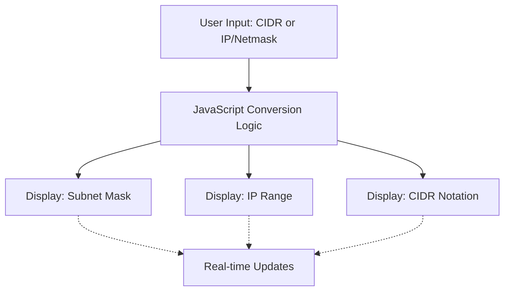

# IP Calculator Project Plan

## Project Overview
A responsive web-based tool that performs real-time conversions between CIDR notation, IP addresses, and subnet masks. The calculator updates results as the user types, without requiring form submission. Supports both IPv4 and IPv6.

## Key Features
- Convert CIDR (e.g., /24 or /64) to subnet mask (255.255.255.0 or equivalent for IPv6)
- Convert CIDR to IP range (e.g., 192.168.1.0 - 192.168.1.255 for IPv4, or IPv6 range)
- Convert IP address and netmask to CIDR notation
- Real-time updates on input changes
- Responsive design for mobile, tablet, and desktop
- Support for both IPv4 and IPv6 protocols

## Architecture

## Todo List
1. Define IP conversion functions (CIDR to netmask, CIDR to IP range, IP/netmask to CIDR) - Include IPv6 support
2. Design responsive UI layout with input fields and output displays
3. Create HTML structure for the calculator interface
4. Implement CSS for responsive design (mobile, tablet, desktop)
5. Write JavaScript logic for real-time conversions and event handling
6. Add input validation and error handling
7. Test the calculator with various inputs and refine as needed